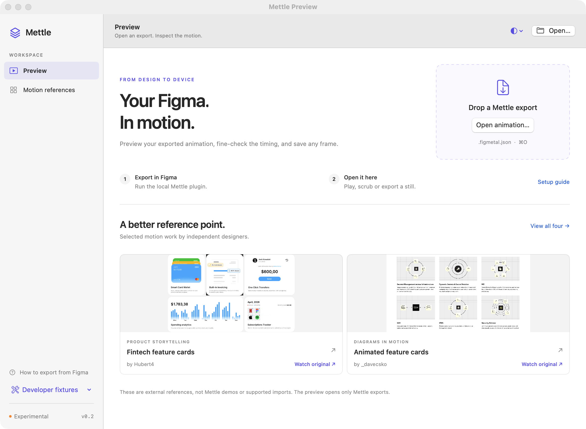
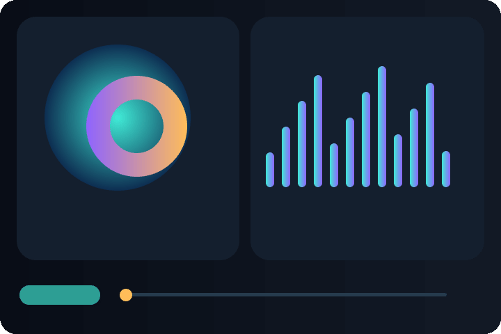
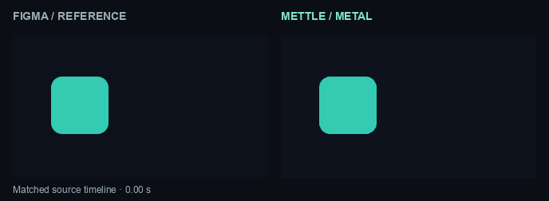
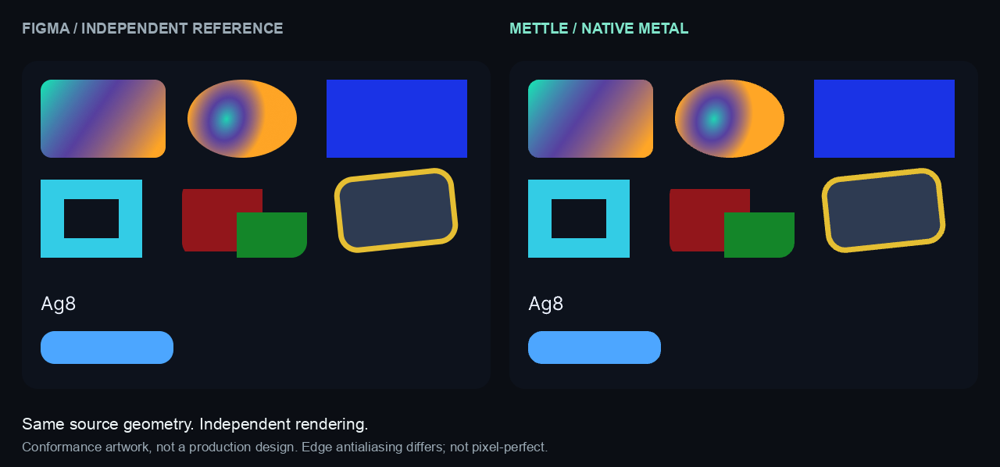

# Mettle

**Design in Figma. Move in Metal.**

[](https://github.com/Amal-David/mettle/actions/workflows/test.yml)

[](LICENSE)

> [!WARNING]
> **Experimental v0.3.** A working renderer for a defined subset of Figma, not a drop-in player for every design or prototype. APIs and the asset schema may change. Do not depend on it for production yet.

Mettle reads the original paths, paints, transforms, and supported animation tracks from Figma and renders them with Swift and Metal. No Lottie conversion. No browser. No tracing screenshots and hoping the geometry matches.

```text
Figma source → Mettle exporter → scene + animation data → Swift evaluator → Metal
```

The exporter and renderer belong to the same project. A feature is limited by what we implement and verify, not by a third-party animation format. There is no Skia or Rive dependency either.

## Community conversion repair — October 8

The current repair pass uses **real published Material 3 Community components**: eleven captured states across a loading indicator, switch, circular progress, and linear progress. Original Figma PNGs, source geometry, component identities, interaction timing, viewport measurements, and SHA-256 fingerprints are included in the [Community corpus](fixtures/community/material3/README.md).

| Real source case | Current result |
| :--- | :--- |
| Switch Enabled → Hovered | Converts the genuine 200 ms source interaction into two native paint bindings. The appearing state-layer fill and its overflow bounds are preserved. |
| Eleven captured endpoints | All compile from original vectors. Independent Figma PNGs are retained for native comparison. |
| Seven loading-indicator transitions | Explicitly blocked because source paths, size and clipping change. No guessed morph or dissolve is exported. |
| Circular and linear progress variants | Static artwork; their inspected component sets contain no executable motion. |

The exporter now follows actual interaction direction, resolves component variant targets and descendant hotspots, retains source delays, and catches partially missing motion. The plugin separates keyframe, Smart Animate and static exports, saves replayable source captures and diagnostic reports, and can include original Figma reference PNGs with their exact bounds. Native fixes address frame-resource reuse, empty clips, paint-binding validation and playback state changes.

**Native pixel comparison for this new Community corpus is pending until it runs on a Metal device.** A successful compile or a matching pair of endpoint states does not establish intermediate motion fidelity. The [verification report](docs/COMMUNITY_VERIFICATION.md) keeps those states separate. GitHub CI checks Apple compilation and records whether its runner actually provides Metal before attempting native comparisons.

```bash
node scripts/compile_community.mjs --check
python3 scripts/compare_corpus.py --check-sources
# On a Metal-capable Mac, render and compare the real source cases:
./scripts/verify_community.sh
```

## September Motion compatibility update (historical)

**v0.3 adds resolved custom/composite styles, separate style-local timing, additive slide tracks, exact Back easing curves, and consumer-mode easing/timing token resolution.** Missing styles or unresolved variables block export instead of becoming static artwork.

Exports now use schema **version 2**; update the plugin and Swift runtime together. Older version-1 scenes still load. Native Figma Lottie export remains a separate route—Mettle does not import it or depend on it. The newly announced audio and per-character text animation features are **not yet supported**; the inspected API does not provide a verified capture contract for them. Whole-text transforms/opacity are not the same as per-character animation.

**Historical validation:** the September update recorded 140 tests on the development M4 Pro, Metal API Validation, and an iOS simulator library build. Its 21-frame style probe was compared against Figma video. Those results describe the earlier controlled fixture, not the new Community corpus or the current changes.

[Changes, live-source evidence, migration and test scope →](docs/MOTION_2026_09.md)

## Start with your export

**[Local installation guide](docs/LOCAL_SETUP.md)** · **[Motion references](docs/REFERENCES.md)** · **[Distribution plan](docs/DISTRIBUTION.md)** · [UI audit](docs/UI_AUDIT.md)

The Figma plugin exports the file. The Swift package renders it in your app. The desktop preview is optional: open a file, play or scrub it, then export a frame. No file opens automatically, and renderer diagnostics are not presented as design examples.



The **Motion references** page links to creator-made animations selected for design quality. These are external inspiration, **not Mettle output or supported imports**. The [reference board](docs/reference-board.html) has click-to-load interactive previews when opened locally in a browser. All creators and licenses are credited.

<details>
<summary>Renderer regression fixtures — technical tests, not design references</summary>



Actual Metal output from synthetic test artwork. The runtime evaluates vector geometry; it does not play this GIF.



Left: independent Figma video. Right: Metal output. These are deliberately simple fidelity tests.

</details>

## Open the optional native preview

You need a **Metal-capable Mac and full Xcode**. The package uses Swift tools 5.9+ and declares macOS 13+ / iOS 16+ targets. Older deployment targets and physical iPhones have not been validated. [Test environments →](docs/VERIFICATION.md)

```bash
git clone https://github.com/Amal-David/mettle.git
cd mettle
swift run -c release mettle preview
```

Use **Open animation…** or drag in your `.figmetal.json`. After editing in Figma and saving over the export, use **Reload Export** (⇧⌘R) to keep the current playhead position. The player has playback, restart, speed/repeat, zoom/background and PNG export controls. `demo` remains an alias. To inspect the deliberately simple live-Figma regression fixture:

```bash
swift run -c release mettle preview fixtures/live/motion.figmetal.json
```

## Export your own scene

The development plugin is in [`plugin/`](plugin). Its built `code.js` is checked in, so **there is no npm install step**.

1. In Figma Desktop, import `plugin/manifest.json` as a development plugin.
2. Select a frame or component and run **Mettle — Experimental Metal Export**.
3. Choose **Keyframe animation** or **Static artwork**, inspect the report, and save the scene. Leave incomplete diagnostic export unchecked. For static artwork or a two-state transition, **Use Figma reference bounds** preserves unclipped overflow and offers independent PNG downloads; it requires unrotated, unscaled source roots and a common viewport for both states.
4. Validate and play it:

```bash
swift run -c release mettle validate path/to/scene.figmetal.json
swift run -c release mettle preview path/to/scene.figmetal.json
```

For a bounded A→B animation, select two same-size source states and choose **Smart Animate · two states**. The source interaction determines direction, duration, easing and timeout. Bidirectional interactions require an explicit start state. Matching uses the source hierarchy and verified component identities; it does not reproduce an application's navigation or interaction state machine.

Save the **source capture** and **report** when a conversion fails. Replay the capture without Figma:

```bash
node scripts/compile_capture.mjs animation.source.json \
  --output animation.figmetal.json --report animation.report.json
```

Blocked conversions retain their diagnostic document and return a failing exit status. The ordinary preview rejects them. Incomplete export is an explicit command-line debugging path.

The manifest uses a local development ID. If Figma asks for an assigned ID, follow the isolated-local-manifest steps in the [local guide](docs/LOCAL_SETUP.md). This is not a published Figma Community plugin. The shared capture code has run in live Figma; the complete desktop import/panel workflow is still a separate validation gap.

The `.figmetal.json` extension and `figma-metal` format signature are retained from the original prototype so older scenes continue to load. They are Mettle's own data format, not an external runtime dependency.

## Use it in SwiftUI

Add this repository as a Swift Package dependency and link the **`Mettle`** product. Until there is a stable release, use `main` or pin a reviewed commit. Add the exported JSON to your app's resources and create the renderer once rather than in each `body` evaluation.

```swift
import SwiftUI
import Mettle

struct AnimationScreen: View {
    private let renderer: MetalRenderer

    init(sceneURL: URL) throws {
        let document = try SceneDocument.load(url: sceneURL)
        renderer = try MetalRenderer(scene: document.scenes[0])
    }

    var body: some View {
        MettleView(renderer: renderer)
            .aspectRatio(renderer.scene.width / renderer.scene.height,
                         contentMode: .fit)
            .accessibilityLabel("Animated illustration")
    }
}
```

Pass `time:` for deterministic seeking or leave it `nil` for playback. The view respects Reduce Motion and inactive scene phases. Keep labels, focus, buttons, and navigation in native SwiftUI/UIKit controls; the vector canvas is not an accessible UI framework. Use each renderer from one thread.

## What works, and what does not

| Area | Current implementation |
| :--- | :--- |
| Geometry | Bézier paths, concave fills, nonzero/even-odd holes, source corner geometry, bounded self-intersections. Cached GPU meshes. |
| Paint | Solid fills, linear/radial gradients, paint alpha, verified ordinary paint stacking. |
| Composition | Nested affine transforms, rounded frame clipping, isolated group opacity, transparent output, up to 4× MSAA. |
| Animation | Translation, rotation, scale, opacity, and solid-color tracks; linear/hold/cubic Bézier easing; deterministic evaluation and looping. **Source rotation/scale pivot parity remains unverified.** |
| Text and strokes | Uniform glyph paths exposed by Figma; temporary-copy outline fallback. Text is not editable, searchable, or intrinsically accessible in the runtime. |
| Tools | Figma exporter with replayable source/report/reference export, Swift Package, SwiftUI view, reloadable macOS preview, validator, exact-time PNG/sequence export, benchmark, source and pixel comparison harnesses. |

**Not implemented:** arbitrary Figma shaders, blur/shadows, image/video/pattern paints, advanced blending, sibling masks, path morph/trim, spring easing, changing text/layout, independent nested timelines, general prototype events, or hit testing. Some regional-paint cases are rejected. [Full compatibility notes →](docs/COMPATIBILITY.md)

The current portable checks cover the exporter/host, Swift core/playback, and adversarial comparison measurements. Apple compilation is checked in CI. The connected development Mac was offline during this repair; current native evidence is tracked separately in the [Community verification report](docs/COMMUNITY_VERIFICATION.md). [Historical v0.3 evidence →](docs/MOTION_2026_09.md)

Exports with unsupported features are blocked by default. An explicit incomplete-export override exists for investigation, not as a promise of fidelity.

## Historical Figma conformance comparison

<details>
<summary>See the static conformance comparison</summary>



</details>

The test artwork was created **inside live Figma**. The capture implementation preserved its actual geometry, and independent Figma PNG/video exports supplied the references. Those images are never input to the native renderer.

On the earlier controlled Figma conformance corpus: static mean RGB error was **0.242 / 255**, and the largest detected boundary difference across **61 motion frames** was **1 pixel**. This is not pixel-perfect parity: curved edges and small text differ, the glyph-region mean error was **3.893 / 255**, and flat backgrounds lower the overall average. These historical results do not measure the new Community corpus.

**The previous v0.2 validation passed 106 tests on the development M4 Pro**: 36 exporter/capture, 29 Swift core, 14 actual GPU, 1 renderer-host regression, 21 preview/playback/reference tests, and 5 comparison-measurement tests. Metal API Validation and an arm64 iOS simulator library build also passed. Hosted CI checks source/compiler/core behavior and compilation; it does not claim GPU fidelity.

[Verification and remaining gaps](docs/VERIFICATION.md) · [Machine-readable comparison](docs/media/comparison.json) · [Media provenance](docs/media/README.md)

## Build, test, and reproduce

Node 20+ rebuilds the dependency-free exporter. The complete visual harness additionally needs Python 3 with Pillow and `ffmpeg` / `ffprobe`. Independent reference PNG/MP4 files are included in this repository.

```bash
(cd plugin && npm run build && npm run check && npm test)
swift test                       # Includes real GPU tests on a Metal-capable Mac.
./scripts/verify_live.sh          # Earlier controlled Figma PNG/video corpus.
./scripts/verify_community.sh     # Published Community source endpoints.
# Each runner prints its fresh report path.
```

```bash
# Native GPU output at an exact time.
swift run -c release mettle render --time 1 --output artifacts/frame.png

# Record the output; the runtime still evaluates vector geometry every frame.
swift run -c release mettle frames examples/demo.figmetal.json \
  --fps 30 --frames 120 --output artifacts/frames

# Exact source endpoints, with no loop-end wrap or FPS rounding:
swift run -c release mettle frames \
  fixtures/community/material3/compiled/switch-hover.figmetal.json \
  --times 0,0.20000000298023224 --loop once --output artifacts/switch-frames

# Offscreen timing; not an iPhone FPS or startup-latency measurement.
swift run -c release mettle bench --frames 180
```

```text
Sources/MettleCore/      Scene schema, animation evaluator, path parser, tessellator
Sources/Mettle/          Native renderer, Metal shaders, SwiftUI host
Sources/MettlePreview/   Optional document player, playback model, credited reference gallery
Sources/MettleDemo/      Command-line entry point and example resources
plugin/src/             Figma capture, compiler, panel adapter
Tests/                  Core and actual-GPU tests
fixtures/live/          Original Figma source data and independent references
scripts/                Capture checks, comparison harness, media generation
```

The renderer uses shared Metal shaders, not a different generated shader for every rectangle. Curve subdivision has a finite tolerance. Intersection work is bounded but quadratic; isolated groups use full-target surfaces. Large or deeply nested scenes need more optimization. Display P3, thermal behavior, and broad production fidelity remain unverified.

Only open **trusted exports**. File/geometry/allocation limits are safeguards, not a security sandbox. The plugin requests no network access and does not upload designs. No font files are bundled.

## Contributing

The most useful contribution is a small failing design plus an independent reference, followed by a regression test. Please do not replace Figma goldens with Mettle output to make a test pass. See [CONTRIBUTING.md](CONTRIBUTING.md), the [architecture notes](docs/ARCHITECTURE.md), and [security guidance](SECURITY.md).

Next validation work: production-file coverage, text/edge antialiasing, source rotation/scale pivots, physical-device playback, then additional effects. Nothing in that list is a shipped feature.

## License

[MIT](LICENSE). Mettle is independent and is not affiliated with or endorsed by Figma or Apple. The code license does not grant rights to designs, fonts, or other assets you export.

Reference thumbnails under `Sources/MettlePreview/References/` are **CC BY 4.0**, not MIT. [Credits and original sources](Sources/MettlePreview/References/ATTRIBUTION.md). They remain external inspiration. The new [Material 3 source corpus](fixtures/community/material3/README.md) is separately attributed under CC BY 4.0 and includes tested compiler adaptations of actual Community artwork.
