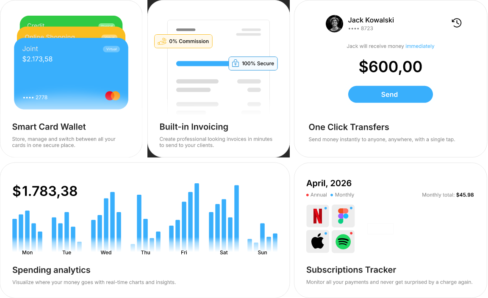
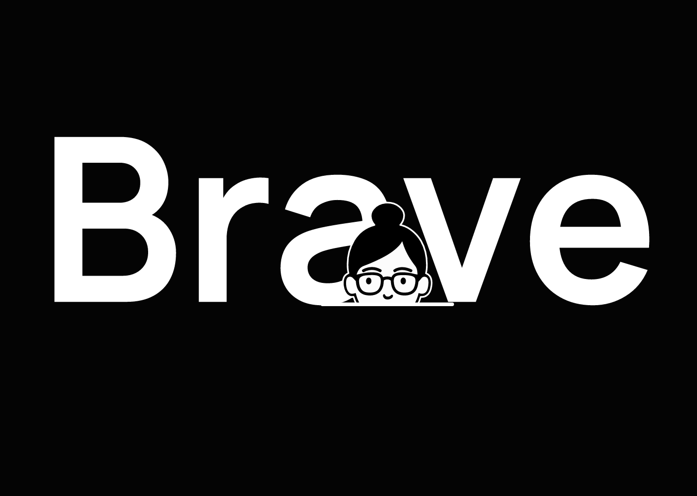
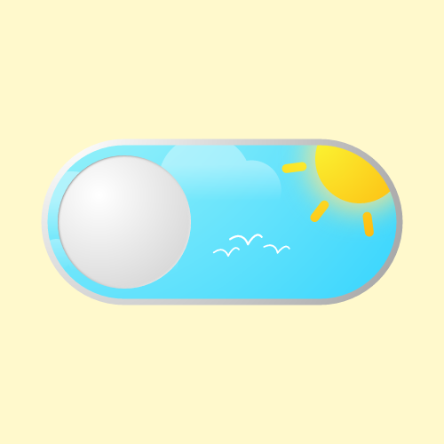

# Motion references

A visual direction board, **not a compatibility demo**. The old conformance shapes test the renderer; they are not our design benchmark. These creator-made animations are the references to study.

Watch the animation on each original page, or open `docs/reference-board.html` in a browser for click-to-load interactive previews. That HTML loads the creators’ official Rive embeds only after a click; it needs internet. It does not run them through Mettle.

## [Fintech feature cards](https://rive.app/marketplace/27520-52011-fintech-feature-cards/)
**Hubert4** · [Watch original](https://rive.app/marketplace/27520-52011-fintech-feature-cards/)

Product storytelling: small movements that communicate what each feature does.

## [Animated feature cards](https://rive.app/marketplace/23017-43043-animated-feature-cards/)
**_davecsko** · [Watch original](https://rive.app/marketplace/23017-43043-animated-feature-cards/)

System diagrams: quiet pacing and meaningful connections.

## [Peekaboo Avatar Animation](https://rive.app/marketplace/21505-40452-peekaboo-avatar-animation/)
**jacquelinea** · [Watch original](https://rive.app/marketplace/21505-40452-peekaboo-avatar-animation/)

Personality: a single readable character gesture rather than generic particles.

## [Light / Dark Mode Switch](https://rive.app/marketplace/23613-44152-light-dark-mode-switch/)
**daviddoesburg** · [Watch original](https://rive.app/marketplace/23613-44152-light-dark-mode-switch/)

State change: the animation explains the difference between the two choices.

## Compatibility is a separate question
These references include interactive states, path effects, character work and shading that have not been ported or verified in Mettle. They are not bundled as native sample scenes. Do not use these previews to claim renderer support.

The first production-quality native demo should be a deliberately scoped Figma design exported through Mettle and compared against the original at matching timestamps. The library’s existing live fixtures remain the fidelity regression tests.

## Credits
The four thumbnails are CC BY 4.0, unmodified apart from proportional display sizing. See [complete attribution](../Sources/MettlePreview/References/ATTRIBUTION.md). Reference embeds use the creators’ official Rive player, not Mettle. Some thumbnail videos are only still states, so the original interactive work is the appropriate reference. No third-party animation runtime is added to the native renderer.
